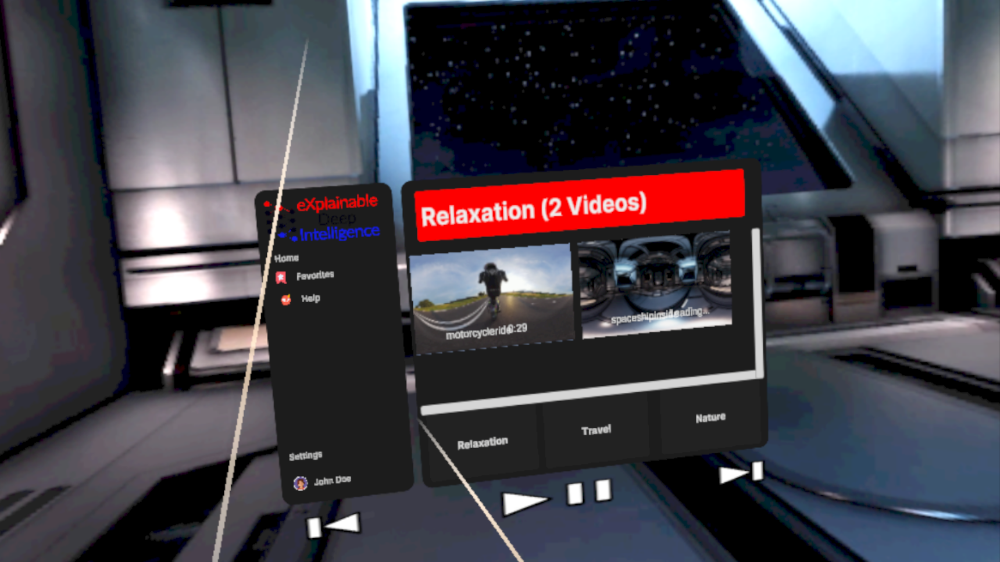

<a id="readme-top"></a>

<!-- PROJECT SHIELDS -->
<!--
*** I'm using markdown "reference style" links for readability.
*** Reference links are enclosed in brackets [ ] instead of parentheses ( ).
*** See the bottom of this document for the declaration of the reference variables
*** for contributors-url, forks-url, etc. This is an optional, concise syntax you may use.
*** https://www.markdownguide.org/basic-syntax/#reference-style-links
-->
[![Contributors][contributors-shield]][contributors-url]
[![Issues][issues-shield]][issues-url]
[![project_license][license-shield]][license-url]


<!-- PROJECT LOGO -->
<br />
<div align="center">
  <a href="https://github.com/xdilab/VR_Player">
    
  </a>

<h3 align="center">Sundown</h3>

  <p align="center">
This project develops a VR-based research platform focused on immersive 360° video experiences and synchronized behavioral and physiological data collection. The system emphasizes stable VR playback, eye tracking, user controls, and UI consistency, followed by integration of wearable sensor data from a Samsung Galaxy Watch. The repository serves as a progress log and data archive supporting ongoing research and future analysis
    <br />
    <a href="https://github.com/xdilab/VR_Player"><strong>Explore the docs »</strong></a>
    <br />
    <br />
    <a href="https://github.com/xdilab/VR_Player">View Demo</a>
    &middot;
    <a href="https://github.com/xdilab/VR_Player/issues/new?labels=bug&template=bug-report---.md">Report Bug</a>
    &middot;
    <a href="https://github.com/xdilab/VR_Player/issues/new?labels=enhancement&template=feature-request---.md">Request Feature</a>
  </p>
</div>


<!-- TABLE OF CONTENTS -->
<details>
  <summary>Table of Contents</summary>
  <ol>
    <li>
      <a href="#about-the-project">About The Project</a>
      <ul>
        <li><a href="#built-with">Built With</a></li>
      </ul>
    </li>
    <li>
      <a href="#getting-started">Getting Started</a>
      <ul>
        <li><a href="#prerequisites">Prerequisites</a></li>
        <li><a href="#installation">Installation</a></li>
      </ul>
    </li>
    <li><a href="#usage">Usage</a></li>
    <li><a href="#roadmap">Roadmap</a></li>
    <li><a href="#contributing">Contributing</a></li>
    <li><a href="#license">License</a></li>
    <li><a href="#contact">Contact</a></li>
    <li><a href="#acknowledgments">Acknowledgments</a></li>
  </ol>
</details>


<!-- ABOUT THE PROJECT -->
## About The Project


Sundown is a virtual reality–based research platform for collecting synchronized physiological and behavioral signals during immersive VR experiences. The system integrates a standalone VR headset, a smartwatch, and a backend server to support controlled data capture, structured logging, and future AI/LLM-based analysis.

<p align="right">(<a href="#readme-top">back to top</a>)</p>


### Built With

* [![Unity][Unity.dev]][Unity-url]
* [![OpenXR][OpenXR.dev]][OpenXR-url]
* [![Vive Wave][ViveWave.dev]][ViveWave-url]
* [![HTC Vive][HTCVive.dev]][HTCVive-url]

<p align="right">(<a href="#readme-top">back to top</a>)</p>


<!-- GETTING STARTED -->
## Getting Started

This section explains how to install and run the Sundown VR application APK on a standalone VR headset.

### Prerequisites

Before installing the APK, make sure you have:.
* Standalone VR headset (HTC Vive Focus Vision)
* USB-C data cable
* Windows
* Android SDK Platform Tools (ADB) installed [Anroid SDK Link](https://developer.android.com/studio/releases/platform-tools)
### Installation
1. Download the APK

2. Enable Developer Mode on the headset
   - On the headset, open **Settings → About**
   - Tap **Build Number** 7 times to enable Developer Options
   - Go back and enable:
     - **Developer Mode**
     - **USB Debugging*
*Allow installation from unknown sources
3. Connect the headset to the computer
   - Use a **USB-C data cable**
   - Put on the headset and approve the **USB debugging** prompt
4. Verify ADB connection
   ```sh
   adb devices
   ```
   -You should see the headset listed.
5. Install the APK
   ```sh
   adb install -r Sundown.apk   
   ```
6. Launch Application
   - From the headset’s app library or
   ```sh
     adb shell monkey -p com.xdilab.sundown 1
   ```
<p align="right">(<a href="#readme-top">back to top</a>)</p>


<!-- USAGE EXAMPLES -->
## Usage

Use this space to show useful examples of how a project can be used. Additional screenshots, code examples and demos work well in this space. You may also link to more resources.

_For more examples, please refer to the [Documentation](https://github.com/xdilab/VR_Player/tree/main/docs)_

<p align="right">(<a href="#readme-top">back to top</a>)</p>


<!-- ROADMAP -->
## Roadmap

- [X] **Phase 0 – Initial Concept & Scope Definition**
    - [X] Defined goal of a calming VR environment paired with physiological data collection
    - [X] Identified VR as the primary interaction surface
    - [X] Chose wearable + VR headset as the core multi-modal setup
    - [X] Scoped project as research infrastructure
- [X] **Phase 1 – Core VR Application & Playback Pipeline**
    - [X] Built initial Unity VR application
    - [X] Implemented immersive 360° video playback
    - [X] Integrated local video playback and playlist control
    - [X] Established RenderTexture-based video rendering
    - [X] Designed minimal, low-cognitive-load VR UI
    - [X] Added session start/stop controls
    - [X] Stabilized immersive playback pipeline
    - [X] Integrated ***REDACTED*** YouTube 360 playback for content sourcing
- [X] **Phase 2 – Eye Tracking, Controls, and VR Stability**
    - [X] Integrated eye tracking into the VR application
    - [X] Logged gaze direction, blink events, fixation, and head pose
    - [X] Stabilized eye-tracking sampling and session timing
    - [X] Implemented and refined VR input controls
    - [X] Stabilized user movement and navigation behavior
    - [X] Reduced unintended motion and visual discomfort
    - [X] Refined UI flow and interaction responsiveness
    - [X] Ensured consistent session start/stop behavior
- [X] **Phase 3 – Galaxy Watch Integration & Physiological Data**
    - [X] Integrated Samsung Galaxy Watch 7 with the VR system
    - [X] Implemented BLE-based data streaming
    - [X] Captured heart rate and inter-beat interval (IBI)
    - [X] Logged raw accelerometer XYZ data
    - [X] Synchronized watch data with VR session lifecycle
    - [X] Integrated stress-related metrics from watch APIs
    - [X] Logged physiological data to timestamped CSV files
- [X] **Phase 4 – Data Synchronization & Repository Structuring**
    - [X] Unified session IDs across VR and watch data
    - [X] Improved BLE reliability and reconnection handling
    - [X] Refined CSV schema and logging consistency
    - [X] Uploaded screenshots, logs, notes, and Unity scripts
- [X] **Phase 5 – Current Focus (Ongoing)**
    - [ ] Improve long-session stability across all systems
    - [ ] Validate timestamp alignment across eye tracking, movement, and watch data
    - [ ] Reduce data loss during intermittent connectivity
    - [ ] Prepare data for downstream analysis<br>
    
See the [open issues](https://github.com/xdilab/VR_Player/issues) for a full list of proposed features (and known issues).

<p align="right">(<a href="#readme-top">back to top</a>)</p>


<!-- LICENSE -->
## License

© 2025 eXplainable Deep Intelligence Lab<br>
Developed under Hamidzera Moradi.<br>  
Primary author: Kirsten Hefney.<br>

This project is licensed under the **GNU General Public License v3.0**.<br>
See the [LICENSE](./LICENSE) file for full terms and conditions.<br>

<p align="right">(<a href="#readme-top">back to top</a>)</p>


<!-- CONTACT -->
## Contact

Kirsten Hefney - khefney@aggies.ncat.edu

Project Link: [https://github.com/xdilab/VR_Player](https://github.com/xdilab/VR_Player)

<p align="right">(<a href="#readme-top">back to top</a>)</p>


<!-- ACKNOWLEDGMENTS -->
## Acknowledgments

* []()
* []()
* []()

<p align="right">(<a href="#readme-top">back to top</a>)</p>


<!-- MARKDOWN LINKS & IMAGES -->
<!-- https://www.markdownguide.org/basic-syntax/#reference-style-links -->
[contributors-shield]: https://img.shields.io/github/contributors/xdilab/VR_Player.svg?style=for-the-badge
[contributors-url]: https://github.com/xdilab/VR_Player/graphs/contributors
[forks-shield]: https://img.shields.io/github/forks/xdilab/VR_Player.svg?style=for-the-badge
[forks-url]: https://github.com/xdilab/VR_Player/network/members
[stars-shield]: https://img.shields.io/github/stars/xdilab/VR_Player.svg?style=for-the-badge
[stars-url]: https://github.com/github_xdilab/VR_Player/stargazers
[issues-shield]: https://img.shields.io/github/issues/xdilab/VR_Player.svg?style=for-the-badge
[issues-url]: https://github.com/xdilab/VR_Player/issues
[license-shield]: https://img.shields.io/github/license/xdilab/VR_Player.svg?style=for-the-badge&cacheSeconds=300
[license-url]: https://github.com/xdilab/VR_Player/blob/main/LICENSE
[linkedin-shield]: https://img.shields.io/badge/-LinkedIn-black.svg?style=for-the-badge&logo=linkedin&colorB=555
[linkedin-url]: https://linkedin.com/in/linkedin_username
[product-screenshot]: images/screenshot.png
<!-- Shields.io badges. You can a comprehensive list with many more badges at: https://github.com/inttter/md-badges -->
[Next.js]: https://img.shields.io/badge/next.js-000000?style=for-the-badge&logo=nextdotjs&logoColor=white
[Next-url]: https://nextjs.org/
[React.js]: https://img.shields.io/badge/React-20232A?style=for-the-badge&logo=react&logoColor=61DAFB
[React-url]: https://reactjs.org/
[Vue.js]: https://img.shields.io/badge/Vue.js-35495E?style=for-the-badge&logo=vuedotjs&logoColor=4FC08D
[Vue-url]: https://vuejs.org/
[Angular.io]: https://img.shields.io/badge/Angular-DD0031?style=for-the-badge&logo=angular&logoColor=white
[Angular-url]: https://angular.io/
[Svelte.dev]: https://img.shields.io/badge/Svelte-4A4A55?style=for-the-badge&logo=svelte&logoColor=FF3E00
[Svelte-url]: https://svelte.dev/
[Laravel.com]: https://img.shields.io/badge/Laravel-FF2D20?style=for-the-badge&logo=laravel&logoColor=white
[Laravel-url]: https://laravel.com
[Bootstrap.com]: https://img.shields.io/badge/Bootstrap-563D7C?style=for-the-badge&logo=bootstrap&logoColor=white
[Bootstrap-url]: https://getbootstrap.com
[JQuery.com]: https://img.shields.io/badge/jQuery-0769AD?style=for-the-badge&logo=jquery&logoColor=white
[JQuery-url]: https://jquery.com 
[Unity.dev]: https://img.shields.io/badge/Unity-100000?style=flat-square&logo=unity&logoColor=white
[Unity-url]: https://unity.com/
[OpenXR.dev]: https://img.shields.io/badge/OpenXR-6E4AFF?style=flat-square&logo=khronosgroup&logoColor=white
[OpenXR-url]: https://www.khronos.org/openxr/
[ViveWave.dev]: https://img.shields.io/badge/Vive%20Wave-00B3E6?style=flat-square&logo=htc&logoColor=white
[ViveWave-url]: https://developer.vive.com/resources/vive-wave/
[HTCVive.dev]: https://img.shields.io/badge/HTC%20Vive-00B3E6?style=flat-square&logo=htc&logoColor=white
[HTCVive-url]: https://www.vive.com/
